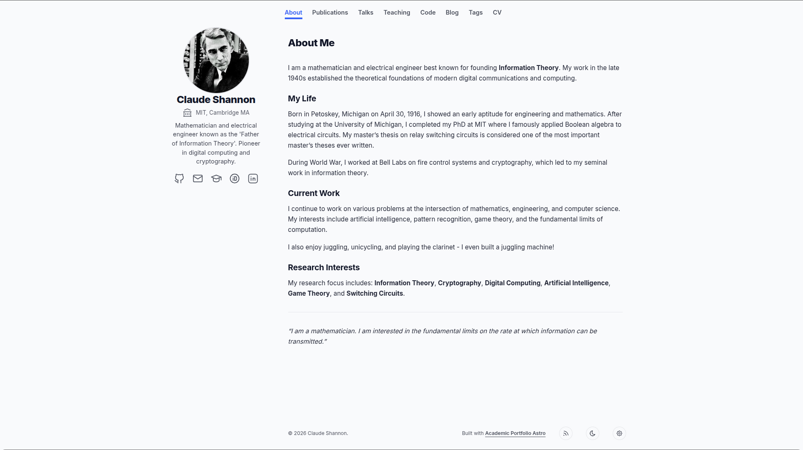

# 🎓 Academic Portfolio Astro

[](https://astro.build/)
[](https://tailwindcss.com/)
[](https://www.typescriptlang.org/)
[](https://opensource.org/license/mit)



A fast, minimalist, and highly customizable Astro template designed specifically for researchers, professors, PhD students, and academics. 

Strongly inspired by [Academic Pages](https://github.com/academicpages/academicpages.github.io) and [AstroPaper](https://github.com/satnaing/astro-paper), this template prioritizes content readability, SEO discoverability, and ease of configuration without touching the UI code.

> 🌟 **[View the Live Demo](https://shannon.github.io/academic-portfolio-astro/)**

## ✨ Features

- **Markdown-Driven Collections:** Easily manage your `Bio`, `Blog`, `Publications`, `Projects`, `Talks`, `CV`, and `Teaching` experience purely through `.md` files, **no programming knowledge required**.
- **Academic Standard Support:** Out-of-the-box $\LaTeX$ rendering support via `remark-math`/`rehype-katex`.
- **Extensive Theming System:** Built-in Light/Dark mode toggle with a highly customizable underlying design system and several preset color palettes.
- **Toggleable Sections:** Don't need a "Talks" or "Teaching" section? Disable them globally with a single boolean flag in your config.
- **Peak Performance:** Built with Astro and Tailwind CSS v4 (via `@tailwindcss/vite`), yielding near-perfect Lighthouse scores and minimal client-side JavaScript.
- **Analytics:** Includes native configuration options for self-hosted Umami analytics (`umami.websiteId`), as well as GA4 support (`ga4Id`).
- **Two-Column Architecture:** Optimized layout with a sticky left profile sidebar and a scrollable main content area.

## 🚀 Getting Started

### 1. Bootstrap the Repository

**Via GitHub CLI (Recommended):**
```bash
gh repo create my-portfolio --template="rubzip/academic-portfolio-astro" --clone
cd my-portfolio
```

**Via Standard Git:**
```bash
git clone https://github.com/rubzip/academic-portfolio-astro.git my-portfolio
cd my-portfolio
```

### 2. Install Dependencies
This project uses Node.js (requires **Node.js >= 22.12.0**).
```bash
npm install
```

### 3. Start Development Server
```bash
npm run dev
```
Your local server will start at `http://localhost:4321`.

## 📂 Architecture & Structure

This project follows a centralized configuration architecture and is driven entirely by Markdown/MDX content.

```text
/
├── public/                 # Static assets (images, favicon, robots.txt)
├── src/
│   ├── assets/             # Global icons (`icons.ts`)
│   ├── components/         # Reusable Astro UI components (Tailwind classes used for styling)
│   ├── config/             # ⚙️ ALL GLOBAL CONFIGURATION LIVES HERE
│   │   ├── site.ts         # Meta details & Analytics (SITE, THEME_CONFIG, SETTINGS)
│   │   ├── pages.ts        # Enable/Disable sections & subtitles (PAGES)
│   │   ├── themes.ts       # Color palettes
│   │   ├── navigation.ts   # Navbar links (NAV_LINKS)
│   │   └── social.ts       # Social media links (SOCIALS)
│   ├── content/            # 📝 ALL MARKDOWN CONTENT LIVES HERE
│   │   ├── bio.md
│   │   ├── cv.md
│   │   ├── posts/
│   │   ├── projects/
│   │   ├── publications/
│   │   ├── talks/
│   │   └── teaching/
│   ├── layouts/            # Page layout wrappers
│   ├── pages/              # Astro routing
│   ├── styles/             # Global CSS (`global.css` - Theme colors, base styles)
│   └── types/              # TypeScript interfaces (content, display, config, themes)
└── content.config.ts       # Zod schemas for all markdown collections
```

## 📖 Documentation & Setup

For a comprehensive, step-by-step guide on how to configure your site, modify the design, and write new content, please refer to the dedicated setup post included in this template:

**👉 [Setting up Your Academic Portfolio](src/content/posts/setting-up-portfolio.md)**


## 📋 Configuration

All configuration is managed centrally in the `src/config` directory. Modify these files to personalize your portfolio without touching any UI code:

| File | Purpose |
| :--- | :--- |
| [`pages.ts`](src/config/pages.ts) | Enable/disable entire sections (e.g., `talks`, `teaching`) and set page subtitles. |
| [`themes.ts`](src/config/themes.ts) | Define and manage all color palettes. Use `THEME_CONFIG` in `site.ts` to apply. |
| [`site.ts`](src/config/site.ts) | Manage metadata, analytics keys (Umami/GA4), and critical file paths. |
| [`navigation.ts`](src/config/navigation.ts) | Define the primary navigation bar links. |
| [`social.ts`](src/config/social.ts) | Configure social media links appearing in the footer and header. |


## 🛠️ Build Commands

All standard build commands run through `npm`:

| Command | Action |
| :--- | :--- |
| `npm run dev` | Starts the local development server on `localhost:4321` |
| `npm run build` | Builds your project for production output into `./dist/` |
| `npm run preview` | Previews your production build locally |
| `npm run format` | Runs Prettier on all files to format code |

## 🤝 Contributing & License

Contributions, issues, and feature requests are always welcome! Feel free to check the [issues page](https://github.com/rubzip/academic-portfolio-astro/issues).

This project is licensed under the **MIT License** - see the `LICENSE` file for details.
